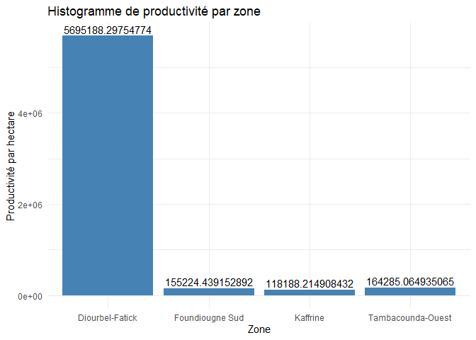
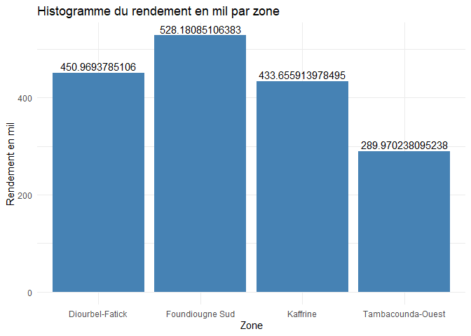
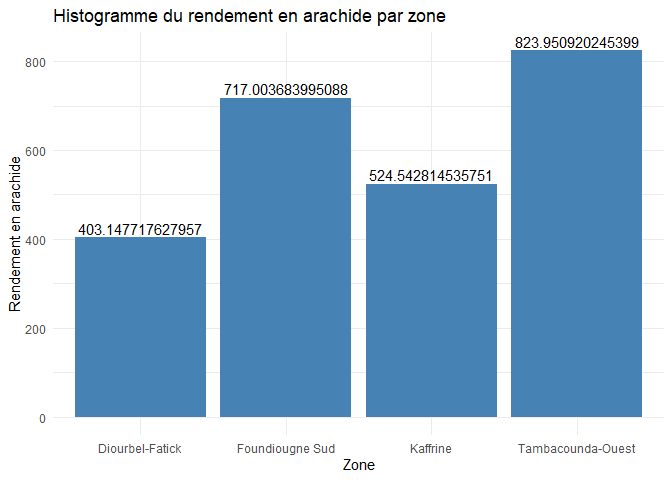
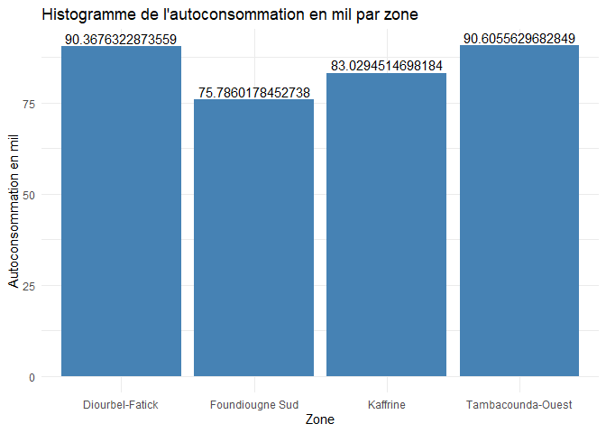
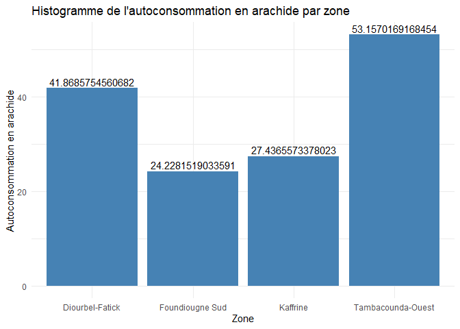
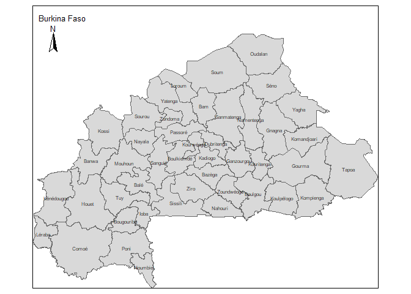
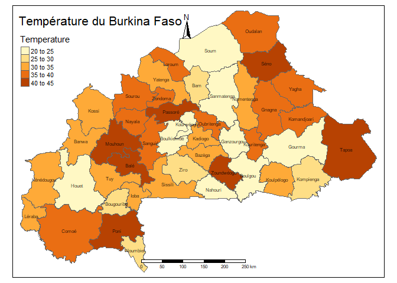
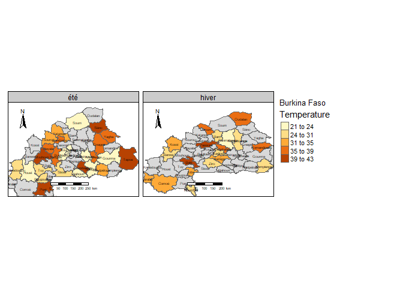
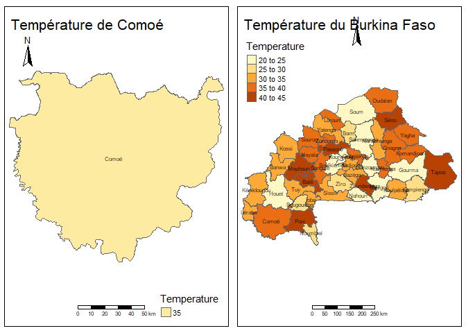

## Bibliothèques


```r
library(tidyverse)
library(sf)
library(tmap)
#remotes::install_github("MaelTheuliere/variousdata")
library(variousdata)
```

# Introduction
Dans le cadre du cours de Statisitiques agricoles, il nous a été demandé de produire des indicateurs par ménages et par zones du Sénégal dans le but de mieux nous familiariser avec les situations qui prévalent. 


# Préparation des données

## Importation de la première feuille


```r
library(readxl)
path <- here::here()
way <- paste0(path,"/application beamer et html/base/TAPE_2022.xlsx")
donnees = read_xlsx(way,sheet= 1)
donnees = data.frame (donnees)
```


## Renommer la variable _index en key
D'abord, nous allons afficher les noms des variables


```r
library(dplyr)
colnames(donnees)
```


Nous allons maintenant changer la variable index en key


```r
names(donnees)[names(donnees) == "X_index"] <- "key"
```


## Retention des variables utiles

Les variables utiles retenues sont les suivantes :


```r
donnees = select(donnees,country,starts_with("loca"),hh_men:dest,seedsexp,fertexp,key)
```


## Etiquettage de la variable country

Dans cette partie, nous allons créer une variable comportant les etiquettes des pays.


```r
country_code = read_xlsx(paste0(path,"/application beamer et html/base/country_codes.xlsx"))

donnees = merge(donnees,country_code, by = "country")
```


Nous allons présenter les pays présents dans la base.


```r
table(donnees$country_2)
```


Les pays présents dans la base sont l'Argentine, Brésil, Cambodge, Gabon, Guinée équatoriale, Indonésie, Norvège, Ouganda, Pérou, Portugal, Sénégal et Suisse.


## Filtrer les ménages sénégalais

Le code du Sénégal est 195.


```r
donnees_filtre = subset(donnees,country == 195)
```


# Nettoyage des données

## Application du premier niveau de nettoyage

Dans cette partie, il sera question de nettoyer les données.
Uniformisons d'abord les localités.


```r
library(dplyr)
library(stringr)

donnees_filtre <- donnees_filtre %>%
  mutate(location1 = tolower(location1),
         location2 = tolower(location2))


donnees_filtre <- donnees_filtre %>%
  mutate(commune = case_when(
    str_detect(location1, "fatick|foundi") ~ "Keur Samba Gueye",
    str_detect(location1, "nior") ~ "Nioro Alassane Tall",
    str_detect(location1, "gain") | str_detect(location2, "gaint") ~ "Gainthe Pathe",
    str_detect(location1, "mouride") ~ "Ida Mouride",
    str_detect(location1, "maka") ~ "Maka Yop",
    str_detect(location1, "diouroup") ~ "Diouroup",
    str_detect(location1, "missira") ~ "Missirah Wadene",
    str_detect(location1, "ndoga") ~ "Ndoga Babacar",
    str_detect(location1, "ndiob|ndiop") ~ "Ndiob",
    str_detect(location1, "ngohe") ~ "Ngohe",
    str_detect(location1, "ngoye") ~ "Ngoye",
    str_detect(location1, "khar") ~ "Niakhar",
    str_detect(location1, "patar") ~ "Patar Sine",
    str_detect(location1, "sinthiou") ~ "Sinthiou Maleme",
    str_detect(location1, "taguine") ~ "Tattaguine",
    str_detect(location1, "toubacouta") ~ "Toubacouta",
    str_detect(location1, "koussanar|tambacounda") ~ "Koussanar",
    TRUE ~ NA_character_
  ))

donnees_filtre <- donnees_filtre %>%
  mutate(commune = case_when(
    location1 == "e" ~ "Ida Mouride",
    location1 == "mbaye" ~ "Tattaguine",
    location1 == "simong bambara" | location1 == "nio" ~ "Nioro Alassane Tall",
    location1 == "kounguel" ~ "Maka Yop",
    location1 == "ndob" ~ "Ndiob", TRUE ~ commune
  ))
```


Nous allons créér la variable *commune*.


```r
donnees_filtre <- donnees_filtre %>%
  mutate(comcode = case_when(
    commune == "Ngoye" ~ 1,
    commune == "Ngohe" ~ 2,
    commune == "Diouroup" ~ 4,
    commune == "Ndiob" ~ 5,
    commune == "Niakhar" ~ 6,
    commune == "Patar Sine" ~ 7,
    commune == "Tattaguine" ~ 8,
    commune == "Keur Samba Gueye" ~ 9,
    commune == "Nioro Alassane Tall" ~ 10,
    commune == "Toubacouta" ~ 11,
    commune == "Gainthe Pathe" ~ 12,
    commune == "Ida Mouride" ~ 13,
    commune == "Maka Yop" ~ 14,
    commune == "Missirah Wadene" ~ 15,
    commune == "Koussanar" ~ 16,
    commune == "Ndoga Babacar" ~ 17,
    commune == "Sinthiou Maleme" ~ 18,
    TRUE ~ NA_integer_
))
# Création de la variable zone

donnees_filtre <- donnees_filtre %>%
  mutate(zone = case_when(
    between(comcode, 1, 8) ~ 1,
    between(comcode, 9, 11) ~ 2,
    between(comcode, 12, 15) ~ 3,
    between(comcode, 16, 18) ~ 4,
    TRUE ~ NA_integer_
  ))

donnees_filtre$zone <- factor(donnees_filtre$zone, levels = c(1, 2, 3, 4), labels = c("Diourbel-Fatick", "Foundiougne Sud", "Kaffrine", "Tambacounda-Ouest"))
```


## Inspection de la variable zone


```r
table(donnees_filtre$zone)

#Suppresssion des ménages qui n'ont pas de zone


donnees_filtre = subset(donnees_filtre,!is.na(zone))
```


## Sauvegarde de la base


```r
library(openxlsx)
path1 <- paste0(path,"/application beamer et html/base")
write.xlsx(donnees_filtre, path1, rowNames = FALSE)
```


## Importation de la base_culture


```r
library(readxl)
base_culture = read_xlsx(paste0(path,"/application beamer et html/base/TAPE_2022.xlsx"),sheet="c1")
base_culture = data.frame (base_culture)
```


## Renomination de la variable _parent_index


```r
names(base_culture)[names(base_culture) == "X_parent_index"] <- "key"
```


## Fusion des deux bases


```r
base = merge(base_culture,donnees_filtre, by = "key")
```
Certaines observations n'ont pas été fusionnées car il n'a pas été trouvé de correspondance dans la base ménage.


## Elimination des observations pour lesquelles les superficies et les productions sont nulles


```r
base = subset (base, cprod!= 0 & cland != 0 )
```


## Imputation des  superficies nulles par les rendements moyens des communes


```r
rendement = select(base,commune,cname_label,cprod,cland)
rendement = subset(rendement,cname_label!= 7777)
rendement <- rendement %>%
  group_by(commune,cname_label) %>%
  summarise(Rendement_moyen  = sum(cprod)/sum(cland))
```


Nous allons remplacer les superficies nulles par la production sur le rendement moyen en tenant compte de la commune et de la culture.


```r
base= left_join(base,rendement, by = c("commune","cname_label"))

base <- base %>%
  mutate(cland=ifelse((cland==0 & cname_label!= 7777),cprod/Rendement_moyen,cland))
```


# Calcul des indicateurs

## Productivité par hectare des ménages


```r
base_valprod <- select(base,key,zone,cname_label,cland,cgift,cqsold,cprod,cpg)

base_valprod$valprod <- base_valprod$cprod*base_valprod$cpg

base_prod <- base_valprod %>%
  group_by(key)%>%
  summarize(valprod_mng=sum(valprod),surf_ttle_mng=sum(cland))

base_prod$productivite_ha=base_prod$valprod_mng/base_prod$surf_ttle_mng
```


## Rendement du mil par ménages


```r
base_mil = subset(base_valprod,cname_label==79)

base_mil <- base_mil %>%
  group_by(key)%>%
  summarize(cprod_total=sum(cprod),cland_total=sum(cland))

base_mil$rendement_mil = base_mil$cprod_total/base_mil$cland_total

base_mil = select(base_mil,key,rendement_mil)
```


## Rendement de l'arachide par ménages


```r
base_arachide = subset(base_valprod,cname_label==242)

base_arachide <- base_arachide %>%
  group_by(key)%>%
  summarize(cprod_total=sum(cprod),cland_total=sum(cland))

base_arachide$rendement_arachide = base_arachide$cprod_total/base_arachide$cland_total


base_arachide = select(base_arachide,key,rendement_arachide)
```


## Autoconsommation en mil par ménages


```r
base_autoconso_mil = subset(base_valprod,cname_label==79)

base_autoconso_mil<- base_autoconso_mil %>%
  group_by(key)%>%
  summarize(cprod_total=sum(cprod),cgift_total= sum(cgift),cqsold_total= sum(cqsold))

base_autoconso_mil$Auto_cons_mil = (( base_autoconso_mil$cprod_total - 
          base_autoconso_mil$cgift_total - base_autoconso_mil$cqsold_total )/base_autoconso_mil$cprod_total)*100

base_autoconso_mil = select(base_autoconso_mil,key,Auto_cons_mil)
```


## Autoconsommation en arachide par ménages


```r
base_autoconso_arachide = subset(base_valprod,cname_label==242)

base_autoconso_arachide<- base_autoconso_arachide %>%
  group_by(key)%>%
  summarize(cprod_total=sum(cprod),cgift_total= sum(cgift),cqsold_total= sum(cqsold))

base_autoconso_arachide$Auto_cons_arachide = (( base_autoconso_arachide$cprod_total - 
          base_autoconso_arachide$cgift_total - base_autoconso_arachide$cqsold_total )/base_autoconso_arachide$cprod_total)*100

base_autoconso_arachide = select(base_autoconso_arachide,key,Auto_cons_arachide)
```


## Productivité par hectare des zones


```r
base_prod_zone <- base_valprod %>%
  group_by(zone)%>%
  summarize(valprod_zone=sum(valprod),surf_ttle_zone=sum(cland))

base_prod_zone$productivite_ha_zone=base_prod_zone$valprod_zone/base_prod_zone$surf_ttle_zone
```


## Rendement du mil par zone


```r
base_mil_zone = subset(base_valprod,cname_label==79)

base_mil_zone <- base_mil_zone %>%
  group_by(zone)%>%
  summarize(cprod_total=sum(cprod),cland_total=sum(cland))

base_mil_zone$rendement_mil = base_mil_zone$cprod_total/base_mil_zone$cland_total

base_mil_zone = select(base_mil_zone,zone,rendement_mil)
```


## Rendement de l'arachide par zone


```r
base_arachide_zone = subset(base_valprod,cname_label==242)

base_arachide_zone <- base_arachide_zone %>%
  group_by(zone)%>%
  summarize(cprod_total=sum(cprod),cland_total=sum(cland))

base_arachide_zone$rendement_arachide = base_arachide_zone$cprod_total/base_arachide_zone$cland_total

base_arachide_zone = select(base_arachide_zone,zone,rendement_arachide)
```


## Autoconsommation en mil par zone


```r
base_autoconso_mil_zone = subset(base_valprod,cname_label==79)

base_autoconso_mil_zone<- base_autoconso_mil_zone %>%
  group_by(zone)%>%
  summarize(cprod_total=sum(cprod),cgift_total= sum(cgift),cqsold_total= sum(cqsold))

base_autoconso_mil_zone$Auto_cons_mil = (( base_autoconso_mil_zone$cprod_total - 
          base_autoconso_mil_zone$cgift_total - base_autoconso_mil_zone$cqsold_total )/base_autoconso_mil_zone$cprod_total)*100

base_autoconso_mil_zone = select(base_autoconso_mil_zone,zone,Auto_cons_mil)
```


## Autoconsommation en arachide par zone


```r
base_autoconso_arachide_zone = subset(base_valprod,cname_label==242)

base_autoconso_arachide_zone<- base_autoconso_arachide_zone %>%
  group_by(zone)%>%
  summarize(cprod_total=sum(cprod),cgift_total= sum(cgift),cqsold_total= sum(cqsold))

base_autoconso_arachide_zone$Auto_cons_arachide = (( base_autoconso_arachide_zone$cprod_total - 
          base_autoconso_arachide_zone$cgift_total - base_autoconso_arachide_zone$cqsold_total )/base_autoconso_arachide_zone$cprod_total)*100

base_autoconso_arachide_zone = select(base_autoconso_arachide_zone,zone,Auto_cons_arachide)
```


# Analyse des résultats par zone

## Analyse de la productivité


```r
library(ggplot2)
histogramme <- ggplot(base_prod_zone, aes(x = zone, y = productivite_ha_zone)) +
  geom_bar(stat = "identity", fill = "steelblue") +
  geom_text(aes(label = productivite_ha_zone), vjust = -0.3, color = "black", size = 4) +
  labs(title = "Histogramme de productivité par zone",
       x = "Zone",
       y = "Productivité par hectare") +
  theme_minimal()
print(histogramme)
```

<!-- -->
L'histogramme ci-dessus traduit une forte productivité dans la zone Diourbel-Fatick et une faible productivité dans les autres zones.


## Analyse du rendement en mil


```r
histogramme2 <- ggplot(base_mil_zone, aes(x = zone, y = rendement_mil)) +
  geom_bar(stat = "identity", fill = "steelblue") +
  geom_text(aes(label = rendement_mil), vjust = -0.3, color = "black", size = 4) +
  labs(title = "Histogramme du rendement en mil par zone",
       x = "Zone",
       y = "Rendement en mil") +
  theme_minimal()
print(histogramme2)
```

<!-- -->
Les zones de Foundiougne Sud, Diourbel-Fatick et Kaffrine sont propices à la culture du mil car produisant de bons rendements.


## Analyse du rendement en arachide


```r
histogramme3 <- ggplot(base_arachide_zone, aes(x = zone, y = rendement_arachide)) +
  geom_bar(stat = "identity", fill = "steelblue") +
  geom_text(aes(label = rendement_arachide), vjust = -0.3, color = "black", size = 4) +
  labs(title = "Histogramme du rendement en arachide par zone",
       x = "Zone",
       y = "Rendement en arachide") +
  theme_minimal()
print(histogramme3)
```

<!-- -->
Les zones de Tambacounda-Ouest, Foundiougne Sud et Kaffrine sont relativement propices à la culture de l'arachide.


## Autoconsommation en mil par zone


```r
histogramme4 <- ggplot(base_autoconso_mil_zone, aes(x = zone, y = Auto_cons_mil)) +
  geom_bar(stat = "identity", fill = "steelblue") +
  geom_text(aes(label = Auto_cons_mil), vjust = -0.3, color = "black", size = 4) +
  labs(title = "Histogramme de l'autoconsommation en mil par zone",
       x = "Zone",
       y = "Autoconsommation en mil") +
  theme_minimal()
print(histogramme4)
```

<!-- -->
Les populations de Diourbel-Fatick, Tambacounda-Ouest et celles de Kaffrine ont une propension à consommer leur production en mil, relativement élévée.


## Autoconsommation en arachide par zone


```r
histogramme5 <- ggplot(base_autoconso_arachide_zone, aes(x = zone, y = Auto_cons_arachide)) +
  geom_bar(stat = "identity", fill = "steelblue") +
  geom_text(aes(label = Auto_cons_arachide), vjust = -0.3, color = "black", size = 4) +
  labs(title = "Histogramme de l'autoconsommation en arachide par zone",
       x = "Zone",
       y = "Autoconsommation en arachide") +
  theme_minimal()
print(histogramme5)
```

<!-- -->
Les populations de Diourbel-Fatick et Tambacounda-Ouest ont une propension à consommer leur production en arachide, relativement élevée. 


## Un peu de statistique spatiales
### carte statique avec tmap


```r
bkf<- read_sf(paste0(path,"/application beamer et html//BKF/gadm41_BFA_2.shp"))
tmap_mode("plot")
bkf_1 <- tm_shape(bkf) + 
    tm_polygons() + 
   tm_text("NAME_2", size = 0.5, col = "black", alpha = 0.8)+
  tm_layout("Burkina Faso", inner.margins=c(0,0,.1,0), title.size=.8)+
  tm_compass(type = "arrow", position = c("left", "top")) 
bkf_1
```

<!-- -->


### Ajout des etiquettes avec tmap


```r
library(openxlsx)
way<- paste0(path,"/application beamer et html/BKF/température.xlsx")
temperature <- read.xlsx(way)
temperature <- data.frame(temperature)
bkf_2<- merge(bkf, temperature, by = "NAME_2", all.x = TRUE)
bkf_2
```

### Carte choroplèthe


```r
library(tmap)

bkf_2_T <- tm_shape(bkf_2) + 
  tm_polygons("Temperature", title = "Temperature") +
  tm_borders("white", lwd = 0.5) +
  tm_text("NAME_2", size = 0.5, col = "black", alpha = 0.8)+
  tm_layout(title = "Température du Burkina Faso")+
  tm_compass(type = "arrow", position = c("left", "top"))+
   tm_scale_bar(position = c("center","bottom"))
bkf_2_T 
```

<!-- -->
## Avec les Bubbles

```r
bkf_2_B <- tm_shape(bkf_2) + 
  tm_polygons() +
  tm_bubbles(size="Temperature",col="Temperature",textNA = "Valeur manquante")+
  tm_layout(title = "Bubble Température du Burkina Faso")+
  tm_compass(type = "arrow", position = c("left", "top"))+
  tm_compass(type = "arrow", position = c("left", "top"))+
  tm_text("NAME_2", size = 0.5, col = "black", alpha = 0.8)+
   tm_scale_bar(position = c("center","bottom"))
bkf_2_B
```

<!-- -->
### farcet 


```r
bkf_2_P <- tm_shape(bkf_2) + 
  tm_polygons("Temperature", textNA = "Valeur manquante", style = "jenks") +
  tm_facets("Periode")+
  tm_compass(type = "arrow", position = c("left", "top"))+
  tm_text("NAME_2", size = 0.5, col = "black", alpha = 0.8)+
  tm_scale_bar(position = c("center","bottom"))

bkf_1+bkf_2_P
```

<!-- -->
### arrange deux carte

```r
bkf_2_T <- tm_shape(bkf_2) + 
  tm_polygons("Temperature", title = "Temperature") +
  tm_borders("white", lwd = 0.5) +
  tm_text("NAME_2", size = 0.5, col = "black", alpha = 0.8)+
  tm_layout(title = "Température du Burkina Faso")+
  tm_compass(type = "arrow", position = c("left", "top"))+
   tm_scale_bar(position = c("center","bottom"))

bkf_2_comoe <- bkf_2 %>%
  filter(bkf_2$NAME_2=="Comoé") %>%
  tm_shape("")+
  tm_polygons("Temperature", title = "Temperature") +
  tm_borders("white", lwd = 0.5) +
  tm_text("NAME_2", size = 0.5, col = "black", alpha = 0.8)+
  tm_layout(title = "Température de Comoé")+
  tm_compass(type = "arrow", position = c("left", "top"))+
  tm_scale_bar(position = c("center","bottom"))
bkf_2_comoe
```

<!-- -->

```r
tmap_arrange(bkf_2_comoe,bkf_2_T,nrow=1)
```

<!-- -->

### Carte interactive

```r
tmap_mode("view")

bkf_2_T <- tm_shape(bkf_2) + 
  tm_polygons("Temperature", title = "Temperature") +
  tm_borders("white", lwd = 0.5) +
  tm_text("NAME_2", size = 0.5, col = "black", alpha = 0.8)+
  tm_layout(title = "Température du Burkina Faso")+
  tm_compass(type = "arrow", position = c("left", "top"))+
   tm_scale_bar(position = c("center","bottom"))


bkf_2_T
```


